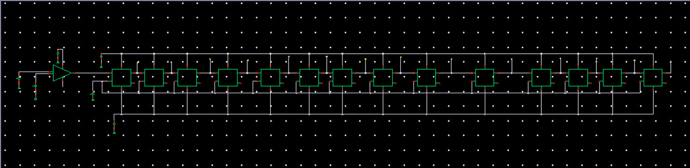
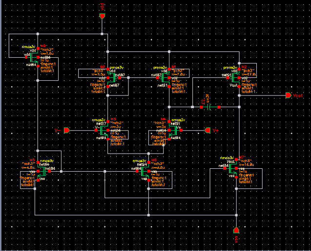
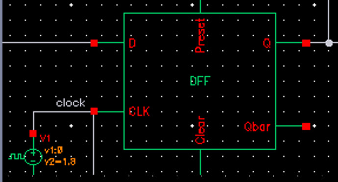
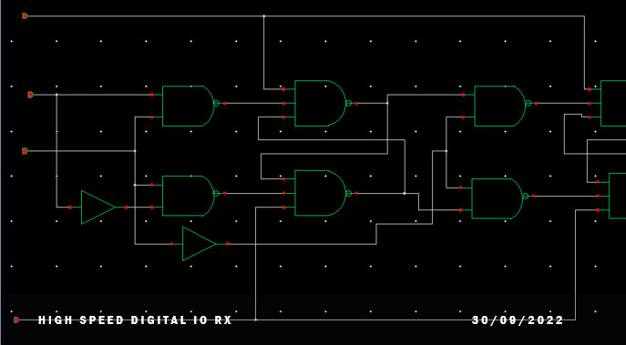
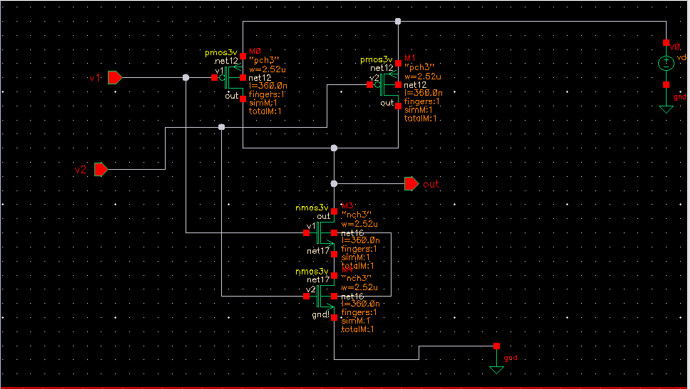
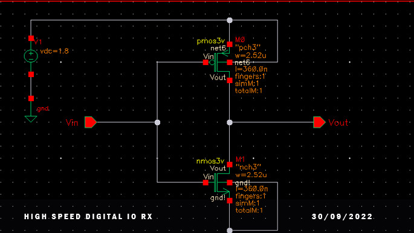
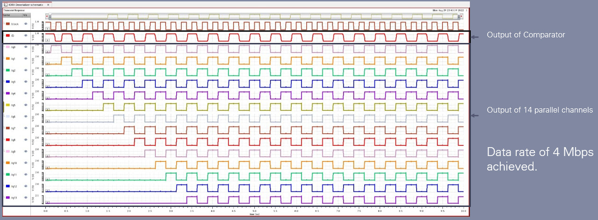
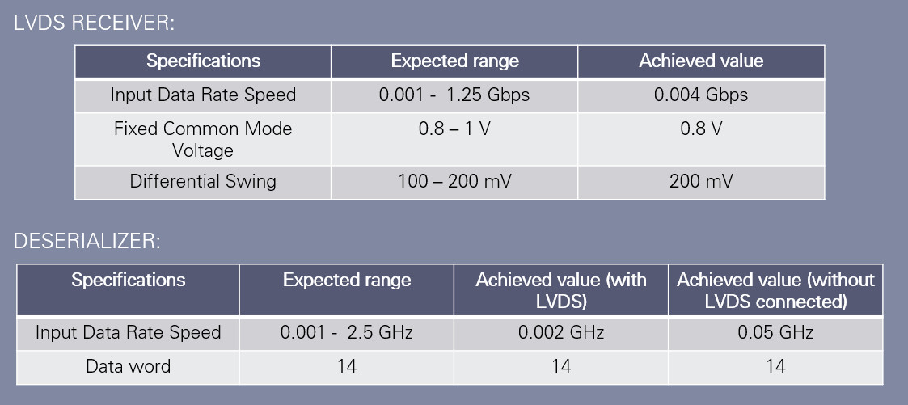

# High-Speed-Digital-IO-RX
Analog Integrated Circuit (Implemented in Virtuoso Cadence)

This project can be divided into 2 blocks
-   LVDS Receiver
-   Deserializer

 

   

   

## **LVDS Receiver**
This is basically a comparator. The comparator stage is a two-stage operational amplifier. The two stages can be categorized as: 
-   Differential amplifier stage
-   Common source amplifier stage

 

   

   

## **Deserializer**
-   A serial to parallel converter.
-   Consists of 14 negative edge triggered D flip flops.

 

## **D Flip-Flop**
 

   
   

  

Inside D flip-flop there are NAND and NOT gates. Static CMOS implementation of these gates are following

 

   
   

  

## **Output**
 

   

   

## **Goals Achieved**
 

   

 

## **Contributors**
1. Md. Tasnim Azad
2. Khaled Mahmud
3. Md. Siratul Mostakim Ifty 
4. Abhishek Das
